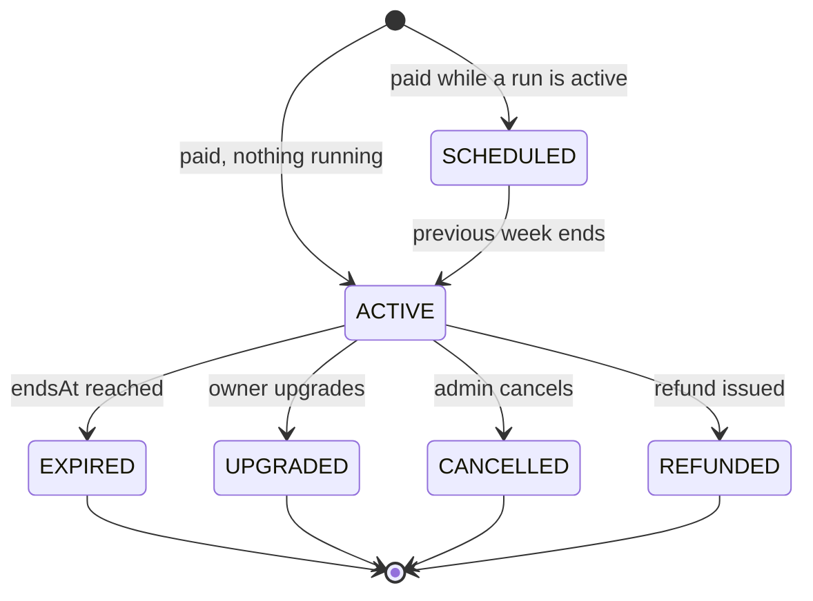
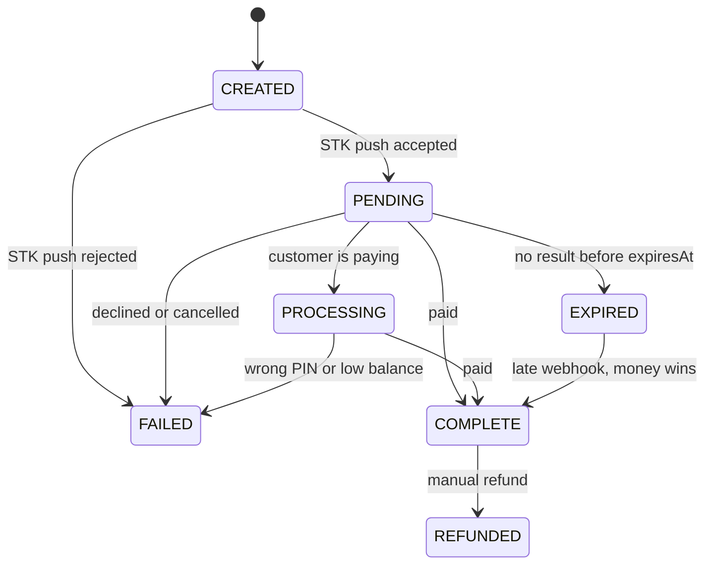
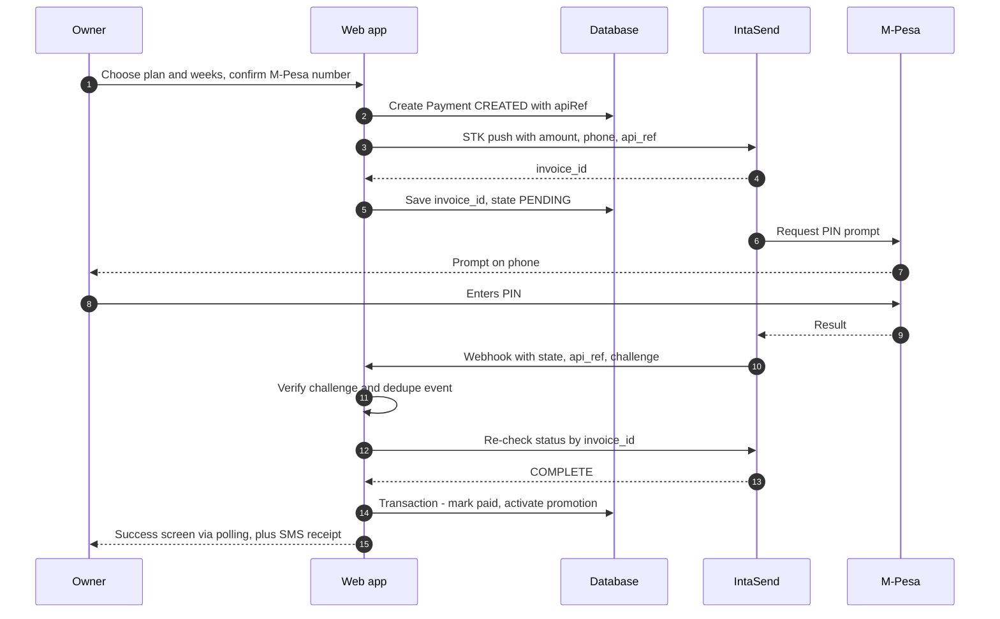

# Campus Business Directory — Product and Technical Design

| | |
|---|---|
| **Working title** | *Campus Directory* (placeholder — naming ideas in §16) |
| **Launch campus** | Moi University, Main Campus (Kesses, Uasin Gishu County) |
| **Version / date** | 1.0 draft · 6 October 2026 |
| **Status** | Planning stage — nothing built yet |
| **Audience** | The founder/builder, any future co-developer or designer, and anyone who needs to understand how the product earns money |

**In one sentence:** a mobile-first web app where businesses around campus publish a profile (contacts, location, photos, services, hours) and students find help in seconds — one tap to call, WhatsApp, or request a booking — while businesses can pay weekly to rank higher.

---

## Key decisions at a glance

| # | Decision | Why |
|---|---|---|
| 1 | **Campus-scoped from day one** (Campus → Zones → Businesses) | Adding Eldoret Town, Annex or West campuses — or another university — becomes configuration, not a rewrite |
| 2 | **Students browse with no account** | Zero friction. Login is only needed to save favourites or leave reviews (v1.1) |
| 3 | **Contact = native deep links** (`tel:` and `wa.me`), no in-app chat | Everyone already lives in WhatsApp and phone calls; nothing to build, run or moderate |
| 4 | **"Book" starts as a WhatsApp-prefilled request**; a booking inbox comes later | Small businesses will not adopt a new inbox on day one |
| 5 | **Three levels: Free, Recommended (KES 100/week), Featured (KES 200/week)** | Your tiers. Featured includes all Recommended perks |
| 6 | **Paid placement is banded but relevance-gated, rotated fairly and capped per page** | A paid listing can never outrank a better match for a query it does not match, so students keep trusting the results — and paying tiers keep their value |
| 7 | **IntaSend M-Pesa STK push, one-off payments, no auto-debit; expiry is enforced at read time** | Fits manual renewal. A failed cron job can never leave a listing promoted past its expiry |
| 8 | **Next.js + TypeScript + Prisma + PostgreSQL, one modular monolith** | One deployable, one database, boring technology; Postgres full-text search is enough for thousands of listings |
| 9 | **Seed listings before launch** (founder + student ambassadors) | An empty directory is worthless. Growth is supply-first |
| 10 | **Promotion requires an approved, reasonably complete listing** | "Recommended" has to mean something or students stop trusting it |

---

## How to read this document

- **[MVP]** = ships in the first public release. **[v1.1]** = next, once the core is proven. **[v2]** = later, when there is demand.
- **⚠ Verify** marks external facts (vendor fees, regulations, platform limits) that were checked in October 2026 but can change — confirm before launch.
- Code and SQL are reference sketches to adapt, not copy blindly.
- MUST / SHOULD / MAY are used in their usual specification sense.
- Legal, tax and compliance notes are practical pointers, not legal or tax advice. Talk to a lawyer/accountant before launch.

## Table of contents

1. [Product overview](#1-product-overview)
2. [Users and journeys](#2-users-and-journeys)
3. [Scope and phasing](#3-scope-and-phasing)
4. [Functional specification](#4-functional-specification)
5. [Promotions and monetization](#5-promotions-and-monetization)
6. [UX and visual design](#6-ux-and-visual-design)
7. [System architecture](#7-system-architecture)
8. [Data model](#8-data-model)
9. [API and route design](#9-api-and-route-design)
10. [Security, privacy and compliance](#10-security-privacy-and-compliance)
11. [SEO and in-product growth mechanics](#11-seo-and-in-product-growth-mechanics)
12. [Observability, quality and DevOps](#12-observability-quality-and-devops)
13. [Operations and go-to-market](#13-operations-and-go-to-market)
14. [Roadmap and estimates](#14-roadmap-and-estimates)
15. [Risks](#15-risks)
16. [Open questions and assumptions](#16-open-questions-and-assumptions)
17. [Appendices](#17-appendices)

---

## 1. Product overview

### 1.1 The problem

**Students**
- Finding a trustworthy phone/laptop fundi, printer, braider, laundry service, photographer or hostel agent depends on word of mouth and WhatsApp group questions. It is slow, noisy and hard to trust.
- Needs are often urgent ("screen just cracked", "need 40 pages printed before 2 pm"), and prices are rarely visible before you walk over.
- First-years have no local network at all.
- The Main Campus is in Kesses, about 35 km from Eldoret town, so "just go to town" is expensive; what is near campus matters.

**Businesses (micro-businesses, freelancers, kiosks)**
- Visibility is foot traffic, WhatsApp Status and posters. None of it is searchable, and posts disappear.
- There is no affordable way to show prices and past work, and no proof of reach. Paid ads on big platforms are out of budget; KES 100–200 a week is not.

**Gap:** no neutral, campus-specific place where "I need X, near me, now" turns into a call or a chat within a minute.

### 1.2 The solution

- A **public directory** (no login) organised by category and campus zone, with fast search that understands local words ("fundi", "kinyozi", "cyber", "mama fua").
- **Rich business profiles**: description, categories, services and price ranges, photos of real work, opening hours, landmark-based location with map pin, and contact buttons.
- **Instant contact**: Call, WhatsApp (with a prefilled message), Request booking, Directions, Share.
- **Self-serve owner dashboard** with simple stats (views, calls, WhatsApp taps) so owners can see value.
- **Weekly paid promotion** (Recommended / Featured) for higher placement and badges, paid by M-Pesa via IntaSend.
- **Admin console** to approve listings, seed listings on behalf of owners, grant/extend promotions, nudge renewals and moderate.

### 1.3 Value proposition

| For | Gets |
|---|---|
| **Students** | One place to find nearby help, see prices and real photos, and reach the provider instantly without installing anything or creating an account |
| **Businesses** | A free professional mini-site and a measurable channel; an optional low-cost way to be seen first |
| **You (the platform)** | A recurring weekly revenue line, first-party data on campus demand (what students search for and cannot find), and a base to expand to other campuses |

### 1.4 Goals and non-goals

**Goals (first 90 days after launch)**
1. 150–200 active, approved listings across at least 10 categories.
2. Students perform meaningful actions: at least 25 % of sessions end in a call/WhatsApp/booking tap.
3. 15–25 businesses buy a promotion at least once, and at least half of them renew.
4. Operating cost stays under KES 10,000 per month at this scale.

**Non-goals (explicitly out of scope for v1)**
- In-app payments *between students and businesses*, escrow, or delivery logistics.
- In-app chat or voice calling.
- A native mobile app (the web app is a PWA; wrap it later if needed).
- A social feed, reels, or gamified social features.
- Auto-debit subscriptions for promotions.

### 1.5 Product principles

1. **Two taps to contact.** From any list, Call or WhatsApp is visible without opening the profile. From a profile it is one tap.
2. **Phone-first and data-light.** Assume mid-range Android, patchy 4G and expensive bundles. Small pages, compressed images, no autoplay video.
3. **Trust before revenue.** Paid placement never overrides relevance, is always labelled, and requires a minimum listing quality.
4. **Meet businesses where they are.** WhatsApp, M-Pesa and phone calls — not a new inbox, not a new habit.
5. **Landmarks over addresses.** Campus addresses are informal ("behind the main gate, next to the pharmacy"). Model that.
6. **Operate by hand first, automate what hurts.** Manual approvals and WhatsApp nudges come before automation.
7. **Boring technology.** One database, one deployable, managed services, few moving parts.
8. **Campus-aware.** Semesters, breaks and closures change demand; the system should know.

### 1.6 Success metrics

**North-star metric: successful contacts per week** = calls + WhatsApp taps + booking requests.

| Area | Metric | Definition | Day-30 target | Day-90 target |
|---|---|---|---|---|
| Supply | Active listings | Approved and visible | 100 | 200 |
| Supply | Listing quality | % with ≥ 3 photos and a description | 60 % | 75 % |
| Supply | Approval time | Submit → live | < 24 h | < 12 h |
| Demand | Weekly active students | Unique anonymous sessions/week | 800 | 2,000 |
| Demand | Contact rate | Sessions with ≥ 1 contact tap | 20 % | 25 % |
| Demand | Zero-result searches | Searches returning nothing | < 15 % | < 8 % |
| Revenue | Paying businesses | Bought ≥ 1 week at least once | 8 | 20 |
| Revenue | Weekly renewal rate | Expiring promotions renewed within 7 days | 40 % | 55 % |
| Revenue | Payment success | STK push → COMPLETE | 80 % | 88 % |
| Trust | Reported listings | Reports / 100 sessions | < 1 | < 0.5 |

Targets are starting points. Re-baseline after the first two weeks of real traffic.

---

## 2. Users and journeys

### 2.1 Personas

| Persona | Context | Needs | Pain today | Success looks like |
|---|---|---|---|---|
| **Wanjiru — student** (primary) | 2nd-year, lives in a private hostel, mid-range Android, buys small data bundles | Repairs, printing, hair, food, laundry, gas, tutors | Doesn't know who is reliable or what it costs; asks in five WhatsApp groups | Finds a provider in under a minute and gets a reply on WhatsApp within ten |
| **Brian — fresher** | New to Kesses, no network | "Where do I find X?" | Overwhelmed; overpays | A browsable, trustworthy map of everything around campus |
| **Kevin — business owner** | Phone repair, 3 years in business, runs on WhatsApp and M-Pesa | More walk-ins and calls | No online presence; can't prove reach | A profile live in 5 minutes, and a weekly count of calls and chats |
| **Mercy — salon owner** | Appointment-based; Instagram-savvy | Bookings, a place to showcase work | Bad reviews worry her; double bookings | Clear booking requests and photos that sell |
| **You — admin/founder** | Runs the platform alone at first | Approve fast, get paid, keep quality | Manual chasing of renewals | One queue for approvals, one for renewals, one for reports |
| **Ambassador** (student agent) | Paid per approved listing | Onboard businesses quickly | Slow forms, no feedback | "Quick add" form that takes under two minutes |

### 2.2 Top student intents (seed for categories, synonyms and SEO)

*Phone screen repair · laptop not charging · braids today · barber/kinyozi · print and bind 60 pages · hostel/room vacancy · gas refill delivery · cheap lunch · laundry pickup · tailor for graduation suit · photographer for graduation · moving out of hostel · revision tutor · data/WiFi router · cake for a birthday · plumber/electrician (fundi).*

### 2.3 Key journeys

**J1 — Student: discover → contact** *(core loop)* **[MVP]**
1. Opens the site from a shared link, a poster QR code, or search. No login, no install.
2. Picks campus/zone once (remembered) and types "screen" or taps a category chip.
3. Sees results ordered by relevance with Featured/Recommended clearly labelled; each row shows photo, name, open-now status, zone/walking time, price hint, and Call / WhatsApp buttons.
4. Taps WhatsApp → WhatsApp opens with a prefilled message. The tap is logged for the owner's stats.
5. *Failure handling:* no results → suggestions plus "Tell us what you need" (logged as demand). Number not working → "Report a problem" in two taps.

**J2 — Owner: self-serve onboarding** **[MVP]**
1. Lands on "List your business — free", enters phone number, receives SMS code.
2. Five short steps: basics → contact → location → photos → services/hours. Progress autosaves; a profile-strength meter shows what is missing.
3. Submits; listing goes to **Pending review**. Owner gets an SMS when approved (target < 24 h).
4. Post-approval screen: "Share your page" (WhatsApp Status image, QR poster, copy link).

**J3 — Admin/ambassador: assisted onboarding and claim** **[MVP]**
1. Ambassador visits the shop, uses the Quick Add form (name, phone, category, zone, landmark, 3 photos), submits.
2. Listing is created as *admin-seeded* with consent noted; the owner receives an SMS: "We listed your business. Claim it with this code to edit."
3. Owner claims via phone-OTP on the listing's phone number; ownership transfers; ambassador is credited.

**J4 — Owner: buy a promotion** **[MVP → Phase 2]**
1. Dashboard shows "Promote this listing" with the two plans and the expected benefits.
2. Chooses plan and number of weeks (1/2/4), confirms the M-Pesa number, taps **Pay**.
3. STK push arrives; owner enters the PIN. The page shows "Waiting for M-Pesa…" and polls.
4. On success: badge and placement activate immediately, SMS receipt is sent, dashboard shows the end date.
5. *Failure handling:* declined/timeout → clear reason and a "Try again" button; the payment record is kept for audit.

**J5 — Owner: renewal after expiry** **[MVP → Phase 2]**
1. 24 h before expiry: SMS/WhatsApp message with a **one-tap renew link** (signed, no login needed) plus in-dashboard banner.
2. At expiry: listing silently reverts to Free (still live). Owner receives "Your Featured week ended: 312 views, 17 calls, 24 WhatsApp taps. Renew?".
3. Renewal link opens a pre-filled checkout (same plan and weeks) — one tap and a PIN.

**J6 — Student: report a problem** **[MVP]**
1. On a profile, taps ⋯ → Report. Reasons: wrong number, not responding, closed down, scam, inappropriate, other.
2. Reports increment a counter; N independent "wrong number/not responding" reports auto-hide the listing pending review (see §4.7).

---

## 3. Scope and phasing

### 3.1 MVP definition (first public release)

The MVP is **useful without payments** and **earns money as soon as payments are on**. Payments are a Phase 2 add-on, but the data model and ranking are built for them from day one, and the admin can *grant* promotions manually in Phase 1 (to test demand, give trials, or record cash/manual M-Pesa payments).

### 3.2 Feature scope by phase

| Area | Feature | Phase |
|---|---|---|
| **Discovery** | Home with search, category grid, zone selector, "Available now", "Featured" carousel | MVP |
| | Search with typo tolerance, local-language synonyms, filters, sort | MVP |
| | Category and category+zone landing pages (SEO) | MVP |
| | Business profile page, gallery, services/prices, hours, map, similar listings | MVP |
| | Save/favourite (needs login) and recently viewed (local) | v1.1 |
| | "Tell us what you need" demand capture | MVP |
| **Contact** | Call, WhatsApp (prefilled), Directions, Share | MVP |
| | Request booking → WhatsApp-prefilled message with service/day/time | MVP |
| | Booking inbox for owners with statuses | v1.1 |
| | Calendar slots for appointment businesses | v2 |
| **Business** | Phone-OTP signup, 5-step onboarding, profile editor, photo manager | MVP |
| | Profile strength meter, "Available now" toggle, "Temporarily closed" | MVP |
| | Dashboard stats (7/30-day views, calls, WhatsApp taps) | MVP |
| | Services and price list, student-discount tag | MVP |
| | Detailed stats by day/source/search term; weekly report | Phase 2 (promoted) |
| **Monetization** | Admin-granted promotions (manual) | MVP |
| | Self-serve plans, IntaSend STK push, webhooks, receipts | Phase 2 |
| | Expiry reminders (SMS/in-app), one-tap renewal links | Phase 2 |
| | Upgrade with credit, bundles, promo codes/trials | v1.1 |
| | Slot caps per category/zone, waitlist | v1.1 (optional) |
| **Trust** | Admin approval, report button, auto-hide on repeated reports | MVP |
| | Verified badge (team-checked) | MVP |
| | Reviews and ratings with owner reply | v1.1 |
| | Listing freshness checks ("still operating?" every 90 days) | v1.1 |
| **Admin** | Approval queue, quick-add, edit/merge/suspend, categories/zones/synonyms | MVP |
| | Payments, promotions, renewal queue with WhatsApp nudges | Phase 2 |
| | Demand insights (zero-result queries), supply/demand dashboard | v1.1 |
| | Campus closure/break mode, ranking config UI | v1.1 |
| **Platform** | PWA install + offline fallback, OG share images, sitemap, JSON-LD | MVP |
| | Kiswahili UI (i18n) | v1.1 |
| | Multi-campus switcher | v2 |
| | WhatsApp Business API notifications | v2 |

### 3.3 Out of scope (and why)

| Item | Reason |
|---|---|
| In-app chat | WhatsApp does it better; no moderation burden |
| Escrow / in-app payments for services | Regulatory and trust complexity; not needed to earn from promotions |
| Native apps | PWA covers the need; revisit after traction |
| Auto-debit renewals | M-Pesa has no default auto-debit; reminders + one-tap renewal are cheaper and more honest |
| Delivery/courier network | Different business |

---

## 4. Functional specification

### 4.1 Student experience (public, no login)

#### 4.1.1 Home page **[MVP]**

Server-rendered, cached per campus+zone for ~60 s; per-session rotation is applied *after* the cache (see §7.4).

| # | Module | Behaviour |
|---|---|---|
| 1 | Header | Logo, campus/zone selector (pill, remembered), language toggle (v1.1) |
| 2 | Search bar | Rotating placeholders ("Try: laptop repair, braids, printing…"); submit → `/search`; typeahead after 2 characters |
| 3 | Intent chips | 8 chips from the most-contacted categories (admin can pin) |
| 4 | **Available now** | Listings with `availableNowUntil > now` in the chosen zone (max 8) |
| 5 | **Featured** | Active Featured listings only, rotated per session, max 6, swipeable, labelled "Featured" |
| 6 | Category grid | 12 categories + "All categories" |
| 7 | New this week | Approved in the last 14 days (max 6) — gives new listings a fair start |
| 8 | Student deals | Listings with a student-discount note (max 6) |
| 9 | "Can't find it?" card | Demand capture (§4.4.8) |
| 10 | Footer | "List your business — free", About, Terms, Privacy, WhatsApp the team |

#### 4.1.2 Search and category results **[MVP]**

**Result row (mobile)**

```
+--------+  Mama Neema Hair Studio     [Verified]
| photo  |  Hair & beauty · Kesses centre · 4 min walk
| 96x96  |  Open now · braids from KSh 800
+--------+  [Recommended]
            [   Call   ] [ WhatsApp ]                 ...
```

- Tap anywhere on the row → profile. Call and WhatsApp work directly from the row.
- **Tier styling:** Featured = yellow left edge + "Featured" sticker; Recommended = teal left edge + "Recommended" sticker; Free = plain. Every promoted row carries a small "Promoted" info link explaining the label.
- **Filters** (bottom sheet on mobile, sidebar on desktop): category (multi), zone (multi), open now, available now, verified, has prices, student discount, service mode (at shop / comes to you / delivery / online), price level.
- **Sort:** *Best match* (default, applies the ranking and tier bands in §4.4), *Nearest*, *Newest*, *Top rated* (v1.1). Explicit sorts are honoured exactly: tier bands are not applied, but badges still show.
- **Pagination:** 10 per page with a **Show more** button (no infinite scroll — it saves data and keeps the footer reachable). Cursor-based with a stable rotation seed so items don't reshuffle between pages.
- **Result summary:** "14 results for "screen" near Kesses centre" + removable filter chips.
- **Empty state:** "Nothing matched "xyz" near Kesses centre." → buttons: *Search all zones*, *Browse categories*, *Tell us what you need* (logs a demand request).

#### 4.1.3 Category and category+zone pages **[MVP]**

`/c/phone-repair` and `/c/phone-repair/kesses-centre`. Same list component as search with the category pre-filtered, an intro paragraph written for SEO (§11), and a "Featured in this category" block at the top. Each page has its own title/description/JSON-LD.

#### 4.1.4 Business profile page **[MVP]**

Order of sections:

1. **Gallery** — swipeable, cover first, tap to zoom, lazy loaded, blur-up placeholders.
2. **Title block** — name, badges (Verified, Featured/Recommended), category chips, open/closed + "Available now" dot, zone and landmark. Rating (v1.1).
3. **Action row** — *Call · WhatsApp · Book* (Book only if enabled) + secondary *Directions · Share · Save*. On scroll this becomes a **sticky bottom bar** with the two main actions (thumb-reach).
4. **About** — description and tags.
5. **Services and prices** — table; "from" prices; student-discount callout.
6. **Hours** — today highlighted; "By appointment" supported.
7. **Location** — static map thumbnail (interactive on tap), landmark text, *Get directions*.
8. **Reviews** *(v1.1)*.
9. **Similar nearby** — same primary category + zone, max 4, ranked with the normal algorithm and labelled.
10. **Footer actions** — *Report a problem*; if the listing is unclaimed, *Is this your business? Claim it*.

Also show "Last confirmed active on {date}" (freshness signal). Suspended/removed listings return a friendly 410 page with alternatives in the same category.

#### 4.1.5 Location and maps **[MVP]**

- Every listing has a **primary zone** (required) and optional **also serves** zones (delivery / comes to you).
- **Landmark text is required**; the map pin is optional. Owners can drop a pin by tapping the map or "I'm at my shop now — use my location".
- **Distance and walk time:** if both the listing pin and the student's reference point (chosen zone anchor, or GPS if they opt in) exist, compute haversine distance; show "≈ N min walk" up to 2 km (walking speed ≈ 75 m/min), otherwise "≈ 2.4 km". GPS is used in memory only and never stored.
- **Map rendering:** MapLibre GL or Leaflet with an OpenStreetMap-based tile source. ⚠ **Verify** the tile provider's usage policy before launch — the public OSM tile servers are not meant for heavy production traffic; use a free-tier tile provider or self-host later. Load the map library only when the user taps the thumbnail.
- **Directions:** `https://www.google.com/maps/dir/?api=1&destination={lat},{lng}` (no API key needed).
- **Privacy:** home-based businesses can choose "show approximate location (zone only)" and hide the pin.

#### 4.1.6 Saved and recently viewed **[v1.1]**

Recently viewed lives in `localStorage` (no account). Favourites require login (phone OTP or Google) and sync across devices.

#### 4.1.7 Resilience states **[MVP]**

Skeleton loaders for lists; offline fallback page listing recently viewed businesses; error pages with a retry and a "WhatsApp the team" link; images degrade to a coloured initials tile.

---

### 4.2 Business profile — field specification **[MVP]**

| Field | Type | Required | Rules | Public |
|---|---|---|---|---|
| name | text | ✓ | 3–60 chars; no all-caps spam; no phone numbers | ✓ |
| slug | text | auto | `kebab(name)-xxxx` (4-char suffix), unique; changes after approval create a 301 redirect | URL |
| tagline | text | – | ≤ 80 chars | ✓ |
| description | text | ✓ | 40–600 chars, plain text with line breaks; links and phone numbers stripped and flagged | ✓ |
| primary category | ref | ✓ | From the managed list | ✓ |
| extra categories | ref[] | – | Up to 3 more | ✓ |
| tags | text[] | – | ≤ 8, ≤ 24 chars each; used for search only (e.g. "iphone screen") | search |
| service modes | enum[] | ✓ | At shop · Comes to you · Delivery · Online | ✓ |
| phone | E.164 | ✓ | Kenyan mobile `^\+254[17]\d{8}$`; verified by OTP; parse with `libphonenumber-js` and accept 07xx/01xx/+254/254 input | ✓ tap-to-call |
| WhatsApp | E.164 | – | Defaults to phone; must be a WhatsApp number | ✓ |
| email | email | – | Private by default (used for receipts/notices) | ✗ |
| website / Instagram / TikTok / Facebook | URL | – | https only; host allow-list per network | ✓ |
| campus, zone | ref | ✓ | Zone is the primary zone | ✓ |
| serves zones | ref[] | – | Where they deliver or travel | ✓ |
| landmark | text | ✓ | 10–140 chars ("Behind main gate, next to the pharmacy") | ✓ |
| address | text | – | Optional free text | ✓ |
| map pin | lat/lng | – | Must fall inside the campus' allowed bounding box; "approximate only" toggle | ✓ |
| hours | schedule | – | Per-day ranges, plus "By appointment" / "24 hours". Overnight ranges are stored as two rows split at midnight | ✓ |
| services | rows | – | ≤ 12 rows: name ≤ 60, priceFrom/priceTo (KES integers), unit ≤ 20 ("per page"), note ≤ 80 | ✓ |
| price level | 1–3 | – | Shown as KSh / KSh KSh / KSh KSh KSh | ✓ |
| student discount | text | – | ≤ 80 chars ("10 % off with student ID") | ✓ |
| booking mode | enum | – | None · Request (v1); Slots (v2) | ✓ |
| photos | images | ✓ ≥ 1 | ≤ 6 in MVP; JPEG/PNG/WebP/HEIC ≤ 8 MB each; client-side resize before upload; server re-encodes to WebP and strips EXIF (GPS!) | ✓ |
| owner name | text | – | Private | ✗ |
| licence number | text | conditional | Required for regulated categories (pharmacy, clinic); verification flag shown, number admin-only | ✗ |
| referral code | text | – | Ambassador attribution | ✗ |

---

### 4.3 Contact actions **[MVP]**

| Action | Link | Notes |
|---|---|---|
| **Call** | `tel:+254712345678` | On desktop, show the number with a *Copy* button instead |
| **WhatsApp** | `https://wa.me/254712345678?text=<url-encoded message>` | Number is digits only, no `+` and no leading zeros |
| **Book** | Opens a small sheet (service, day, time chips, note) → builds a WhatsApp link with the details | Logged as `BOOKING_INTENT`; no student data stored in MVP |
| **Directions** | Google Maps directions URL | Hidden if no pin |
| **Share** | Web Share API → copy-link fallback | URL `/b/{slug}?ref=share`; rich preview via OG image |

**Prefilled message templates** (variables in braces; the app name is appended so owners learn where leads come from):

| Intent | Message |
|---|---|
| General | `Hi {business}, I found you on {app}. I need help with {query or service}. Are you available {today}?` |
| Price | `Hi {business}, how much is {service}? (from {app})` |
| Booking | `Hi {business}, I'd like to book {service} for {day} around {time}. I'm near {zone}. Name: {studentName}. (via {app})` |

**Tracking and integrity**
- Fire `navigator.sendBeacon('/api/events', …)` *before* navigating so the tap is recorded even if the app switch is instant.
- The owner-facing stats count one event per `session + business + type` per 30 minutes; raw events keep everything.
- Ignore events from the business's own authenticated session and from sessions flagged as the owner's device; rate-limit events per session (≤ 60/min) to prevent inflation.

---

### 4.4 Search and ranking **[MVP]**

This is the heart of the product *and* of the revenue model, so it has to be fair, explainable and testable.

#### 4.4.1 Pipeline

```
query → normalise → expand (synonyms, category intent) → retrieve candidates (Postgres)
      → score relevance/proximity/quality → apply tier bands + rotation → compose page → respond
```

#### 4.4.2 Normalise and expand

- Lower-case, trim, collapse spaces, strip punctuation, `unaccent`.
- **Synonym table** maps local and common variants to canonical terms or categories (e.g. *kinyozi → barber*, *saloon → salon*, *mama fua → laundry*, *cyber → printing*, *dawa → pharmacy*). Admin-editable; seed list in Appendix A.
- If the whole query matches a synonym or category name, add a **category intent** (strong relevance boost to listings in that category).

#### 4.4.3 Retrieval (PostgreSQL)

Candidates must satisfy: same campus, `status = ACTIVE`, not soft-deleted, not paused/closed, matching any active filters, **and** at least one of: full-text match on `searchVector`, trigram similarity on `name`, membership of an intent category. Cap at ~300 candidates. Implementation details in §7.5.

#### 4.4.4 Scoring

All components are normalised to 0–1; weights live in the `Setting` table so they can be tuned without a deploy.

| Component | What it measures | Default weight |
|---|---|---|
| `relevance` | Weighted full-text rank (name > categories/tags > services > description) + trigram name similarity + category-intent hit | 0.55 |
| `proximity` | 1.0 same zone · 0.6 adjacent zone · 0.3 serves the zone · 0 otherwise; blended with walking distance if available | 0.20 |
| `quality` | 0.4 × profile completeness + 0.3 × verified + 0.3 × Bayesian-average rating (v1.1; until then, completeness and verified only) | 0.25 |
| `newBoost` | +0.05 for listings younger than 14 days | additive |

`score = 0.55·relevance + 0.20·proximity + 0.25·quality (+ newBoost)`

#### 4.4.5 Tier bands and fair rotation

The rules, in plain language (these are also what you tell business owners):

1. **Eligibility to be shown at all:** `relevance ≥ minRelevance (0.25)` — applies to everyone, paid or not. *A promotion never makes an irrelevant listing appear.*
2. **Featured top block:** up to `topBlockSize` (default **3**) Featured listings with `relevance ≥ 0.50` take the first positions. Among Featured, order is by score *bucket* (scores are rounded to the nearest 0.1 so near-equal listings tie) and then by a **rotation key**.
3. **Promoted block:** everything else that is promoted — Recommended listings plus any Featured overflow or weak matches — follows, ordered by score bucket, then tier (Featured above Recommended within the same bucket), then rotation. *Paying more can never rank you below someone paying less in the same bucket.*
4. **Organic block:** free listings, by score bucket then rotation.
5. **Page guardrail:** at most `maxPromotedPerPage` (default **6 of 10**) promoted rows on a page; additional promoted listings slide to the next page in order. This keeps results useful and free listings visible.
6. **Rotation key:** a stable pseudo-random value from `hash(businessId + seed)` where `seed = sessionId + hour (EAT)`. The same student sees a stable order (pagination works), different students see different orders among equals, and everyone in a bucket gets exposure over time.
7. **Expiry is enforced at read time:** a listing is promoted only if `tierEndsAt > now()` in the query itself. The background sweeper only tidies data and sends notices.

**Why bands rather than score boosts?** A hard band is the clearest promise to a paying owner ("Featured = first"). The cost is that a strong free listing can sit below a weaker promoted one. If that hurts result quality in practice, switch to **soft banding** (`score + 0.35` for Featured, `+ 0.20` for Recommended) so a very strong organic match can still beat a weak promoted match. It is a one-line config change in the ranker.

**Worked example — query "screen repair", Kesses centre**

| Listing | Tier | Relevance score | Bucket |
|---|---|---|---|
| A | Featured | 0.82 | 0.8 |
| B | Featured | 0.78 | 0.8 |
| C | Featured | 0.40 | 0.4 (below the 0.50 top-block floor) |
| D | Recommended | 0.85 | 0.9 (rounds up) |
| E | Recommended | 0.55 | 0.6 |
| F | Free | 0.90 | 0.9 |
| G | Free | 0.60 | 0.6 |

Final order: **A, B** (rotated between them, top block) → **D, E, C** (promoted block, by bucket) → **F, G** (organic). F is the best match overall but free; that is the trade-off bands make explicit.

#### 4.4.6 Reference ranker (TypeScript)

```ts
// src/server/search/rank.ts
export type Tier = 'FEATURED' | 'RECOMMENDED' | 'NONE';

export interface Candidate {
  id: string;
  tier: Tier;          // effective tier at request time (expiry enforced in SQL)
  relevance: number;   // 0..1
  proximity: number;   // 0..1
  quality: number;     // 0..1
  createdAt: Date;
}

export interface RankConfig {
  weights: { relevance: number; proximity: number; quality: number };
  minRelevance: number;          // 0.25
  topBlockSize: number;          // 3
  topBlockMinRelevance: number;  // 0.50
  bucketSize: number;            // 0.1
  pageSize: number;              // 10
  maxPromotedPerPage: number;    // 6
  newListingBoost: number;       // 0.05
}

// Stable pseudo-random in [0,1) from id + seed (FNV-1a). Same session+hour → same order.
function rotation(id: string, seed: string): number {
  let h = 2166136261;
  const s = `${id}:${seed}`;
  for (let i = 0; i < s.length; i++) { h ^= s.charCodeAt(i); h = Math.imul(h, 16777619); }
  return ((h >>> 0) % 100000) / 100000;
}

export function rank(cands: Candidate[], cfg: RankConfig, seed: string, now = new Date()): Candidate[] {
  const score = (c: Candidate) =>
    cfg.weights.relevance * c.relevance +
    cfg.weights.proximity * c.proximity +
    cfg.weights.quality * c.quality +
    (now.getTime() - c.createdAt.getTime() < 14 * 864e5 ? cfg.newListingBoost : 0);

  const bucket = (c: Candidate) => Math.round(score(c) / cfg.bucketSize);
  const tierRank = (t: Tier) => (t === 'FEATURED' ? 2 : t === 'RECOMMENDED' ? 1 : 0);
  const byBucketThenRotation = (a: Candidate, b: Candidate) =>
    bucket(b) - bucket(a) || rotation(a.id, seed) - rotation(b.id, seed);

  const eligible = cands.filter(c => c.relevance >= cfg.minRelevance);

  const topBlock = eligible
    .filter(c => c.tier === 'FEATURED' && c.relevance >= cfg.topBlockMinRelevance)
    .sort(byBucketThenRotation)
    .slice(0, cfg.topBlockSize);
  const inTop = new Set(topBlock.map(c => c.id));

  const promoted = eligible
    .filter(c => c.tier !== 'NONE' && !inTop.has(c.id))
    .sort((a, b) =>
      bucket(b) - bucket(a) || tierRank(b.tier) - tierRank(a.tier) || rotation(a.id, seed) - rotation(b.id, seed));

  const organic = eligible.filter(c => c.tier === 'NONE').sort(byBucketThenRotation);

  return composePages([...topBlock, ...promoted], organic, cfg);
}

// At most `maxPromotedPerPage` promoted rows per page; the rest slide to the next page, in order.
function composePages(promoted: Candidate[], organic: Candidate[], cfg: RankConfig): Candidate[] {
  const out: Candidate[] = [];
  let p = 0, o = 0;
  while (p < promoted.length || o < organic.length) {
    let promotedOnPage = 0;
    for (let slot = 0; slot < cfg.pageSize && (p < promoted.length || o < organic.length); slot++) {
      if (p < promoted.length && promotedOnPage < cfg.maxPromotedPerPage) { out.push(promoted[p++]); promotedOnPage++; }
      else if (o < organic.length) out.push(organic[o++]);
      else { out.push(promoted[p++]); promotedOnPage++; }       // organic exhausted
    }
  }
  return out;
}
```

**Tests that must exist** (Vitest): relevance floor excludes irrelevant paid listings; expired promotion is treated as free; Featured never below Recommended in the same bucket; page guardrail; rotation is stable for a given seed and differs across seeds; ties are distributed roughly evenly over 1,000 seeds.

#### 4.4.7 Typeahead

After 2 characters, suggest (max 8) from: category names and synonyms → business names (trigram prefix) → recent searches (local). Response < 100 ms, cached 5 minutes per prefix, no promoted weighting.

#### 4.4.8 Zero-result handling and demand capture

When a search returns nothing (or only weak matches): offer broader zones and related categories, and **log the normalised query** with campus/zone into `ServiceRequest`. The student can optionally leave a WhatsApp number for "tell me when someone lists this". Admin sees a weekly "unmet demand" report — the best recruiting list for ambassadors.

---

### 4.5 Owner onboarding and dashboard

#### 4.5.1 Onboarding (target: under 5 minutes on a phone) **[MVP]**

| Step | Fields | Notes |
|---|---|---|
| 0. Sign up | Phone number → SMS OTP | Rate limited; Google sign-in optional |
| 1. Basics | Name, primary category (+ up to 3), one-line tagline | Category picker shows icons and examples |
| 2. Contact | Call number (prefilled), WhatsApp (same-as toggle), social links | Number must be OTP-verified |
| 3. Location | Campus, zone, landmark, optional pin | "Use my location" button when at the shop |
| 4. Photos | 1–6 images from camera/gallery | Client-side compression; first = cover |
| 5. Details | Services and prices, hours, student discount, service modes | Skippable but affects profile strength |
| Review | Preview exactly as students see it → Submit | Status becomes **Pending review** |

Autosave every step; resume where left off; a draft that stays incomplete for 3 days triggers one SMS reminder.

#### 4.5.2 Profile strength (completeness) **[MVP]**

| Item | Points |
|---|---|
| Name + primary category | 15 |
| Verified phone | 10 |
| Zone + landmark | 15 |
| ≥ 1 photo / ≥ 3 photos | 10 / +10 |
| Description ≥ 80 chars | 10 |
| ≥ 3 services with prices | 10 |
| Opening hours | 10 |
| Map pin | 5 |
| Tagline or student discount | 5 |

Total 100. Promotion eligibility needs **≥ 60** (see §5.2). The dashboard always shows the single best next action ("Add 2 more photos → +10").

#### 4.5.3 Dashboard modules **[MVP unless noted]**

1. Business switcher (an owner may manage up to 3 listings).
2. **This week** tiles: profile views, calls, WhatsApp taps, directions — each with change vs last week.
3. **Promotion card:** state (Free / Recommended until Tue 14 Oct / Featured…), *Renew* / *Upgrade* / *Promote*; for Free listings shows what promoted listings in the category got last week (aggregate, anonymous).
4. Profile strength meter and next best action.
5. Quick toggles: **Available now** (auto-expires after 4 hours), **Temporarily closed** (until date; hides contact buttons and shows a notice).
6. Edit sections: Profile · Photos · Services · Hours · Location · Contact.
7. Bookings inbox *(v1.1)* and Reviews *(v1.1)*.
8. **Billing:** payments and receipts.
9. **Share kit:** link, QR poster (PDF/PNG), WhatsApp Status image.
10. Support: WhatsApp the team.

#### 4.5.4 Editing rules

- First submission is **pre-moderated**; later edits go live immediately and are **post-moderated** (flagged for review when the owner is < 30 days old or the edit touches name, phone or photos).
- Changing the phone number requires OTP on the *new* number.
- The slug never changes silently; a rename creates a 301.

---

### 4.6 Admin console

#### 4.6.1 Modules **[MVP unless noted]**

| Module | Key screens | Actions |
|---|---|---|
| **Dashboard** | Today: new listings, pending, payments, reports, expiring promotions | Jump to queues |
| **Listings** | Queue (Pending / Active / Suspended), search, detail | Approve · Request changes · Reject (canned reasons) · Edit · Merge duplicates · Suspend · Restore · Verify · Add private notes |
| **Quick add** | Mobile-first form for ambassadors/admin | Create admin-seeded listing + claim code |
| **Promotions** | List by status, per business | Grant (free/trial/comp) · Extend · Cancel · Mark as refunded |
| **Payments** *(Phase 2)* | List with IntaSend invoice IDs and states | Re-check status · Mark manual M-Pesa payment as received · Export CSV |
| **Renewal queue** *(Phase 2)* | Promotions expiring in 48 h or expired in the last 7 days | One-tap **WhatsApp nudge** (prefilled `wa.me` link) · Record outcome (renewed / snoozed / lost + reason) |
| **Reports** | Open reports grouped by listing | Dismiss · Warn · Hide · Suspend |
| **Taxonomy** | Categories, synonyms, zones | CRUD with ordering and icons |
| **Demand insights** *(v1.1)* | Top unmet searches, top searches, top categories by contacts | Export |
| **Campus calendar** *(v1.1)* | Breaks/closures | Create closure → optionally extend active promotions |
| **Settings** | Plan prices, ranking weights, top-block size, caps, feature flags | Versioned and audit-logged |
| **Users and audit** | Roles, sessions, audit log | Disable user · View who changed what |

#### 4.6.2 Roles and permissions

| Capability | Admin | Moderator | Field agent | Finance |
|---|:-:|:-:|:-:|:-:|
| Create listings (quick add) | ✓ | ✓ | ✓ (own) | – |
| Approve/reject/suspend listings | ✓ | ✓ | – | – |
| Edit any listing | ✓ | ✓ | – | – |
| Handle reports | ✓ | ✓ | – | – |
| Grant/extend/cancel promotions | ✓ | – | – | – |
| View payments and export | ✓ | – | – | ✓ |
| Change settings, plans, ranking | ✓ | – | – | – |
| Manage users/roles | ✓ | – | – | – |

All admin accounts require **2FA (TOTP)**. Every mutation writes to the audit log (actor, entity, before/after, time, IP hash).

#### 4.6.3 Approval checklist (SLA < 24 h; aim for 12 h)

1. Category fits the business and is not prohibited (Appendix F).
2. Phone is reachable (quick WhatsApp/call test) — mark *Verified* if the owner confirms.
3. Photos are real, original and appropriate (reverse-image search if suspicious).
4. Description has no banned claims, no scraped text, no embedded phone numbers.
5. Location is plausible for the zone/landmark.
6. Regulated categories include a licence number (pharmacy, clinic, etc.).

Outcome: **Approve** (SMS sent) · **Request changes** (with reason) · **Reject** (with reason).

---

### 4.7 Trust, safety and listing health

| Mechanism | Rule | Phase |
|---|---|---|
| **Verification levels** | L0 unverified · L1 phone OTP · L2 *Verified* (team confirmed number works and business exists). Badge shown for L2 | MVP |
| **Reports** | Reasons: wrong number, not responding, closed down, scam, inappropriate, other. 3 distinct sessions reporting *wrong number/not responding* in 7 days → auto-hide as "Under review" and notify owner; 2 distinct *scam* reports → auto-hide immediately; admin reviews | MVP |
| **Owner recovery** | Owner taps "I'm still active" (re-confirms by OTP) → restored if admin agrees | MVP |
| **Freshness** | Every 90 days SMS "Still operating?" with one-tap confirm; no answer after 14 days → hidden until confirmed | v1.1 |
| **Reviews** | Login required (verified phone); one review per business per 90 days; a "contacted recently" label if the student tapped call/WhatsApp in the last 30 days; owners can reply but not delete; reviews with phone numbers/links are held; admin resolves disputes | v1.1 |
| **Duplicate detection** | Same phone, near-identical name+zone, or pin within 30 m → flagged for merge | MVP |
| **Ban evasion** | Suspended phone numbers cannot create new listings | MVP |

---

### 4.8 Notifications

Cost control: **SMS only for high-value events** (OTP, approval, payment, expiry). Everything else is in-app or email. All messages go through an **outbox table** (idempotent, retried, auditable). Templates are in Appendix D.

| Event | Recipient | Channels |
|---|---|---|
| OTP | User | SMS |
| Listing submitted | Admin | In-app queue (+ email digest) |
| Listing approved / needs changes / rejected | Owner | SMS + in-app |
| Payment received | Owner | SMS + email receipt (if email) + in-app |
| Payment failed or expired | Owner | In-app with retry link |
| Promotion ends in 24 h | Owner | SMS (or WhatsApp) with one-tap renew link + in-app banner |
| Promotion ended | Owner | SMS/WhatsApp with last-week results + renew link |
| New booking request *(v1.1)* | Owner | In-app + SMS/WhatsApp |
| New review *(v1.1)* | Owner | In-app + email |
| Reported listing | Admin | In-app queue |
| Weekly performance *(promoted)* | Owner | WhatsApp/SMS or email |
| Reconfirm listing *(v1.1)* | Owner | SMS |

Providers: SMS via an East-Africa gateway such as Africa's Talking (⚠ verify rates and sender-ID registration); email via any transactional provider; WhatsApp Business API only in v2 (per-conversation fees apply). In the MVP, the admin sends renewal nudges through prefilled `wa.me` links from the Renewal queue — zero cost and high conversion.

---

### 4.9 Analytics and reporting

**Events** (first-party, no third-party trackers)

| Event | When | Stored as |
|---|---|---|
| `impression` | A listing row is ≥ 50 % visible for ≥ 1 s | Aggregated per business/day (batched), *not* one row per impression |
| `profile_view` | Profile opened | Event row |
| `call_tap`, `whatsapp_tap`, `directions_tap`, `booking_intent`, `share`, `save` | Button tapped | Event row |
| `search` | Query submitted | Event row (normalised query, filters, result count, zone) |
| `zero_result` | Search with no results | `ServiceRequest` + event |

Each event carries: anonymous `sessionId` (random UUID in `localStorage`), campus, zone, `source` (search / category / home_featured / direct / share), list position, `tierAtTime`, device class. No IP storage, no fingerprinting.

**Owner-facing metrics:** impressions, profile views, calls, WhatsApp taps, directions, booking intents; contact rate = contacts ÷ profile views; for promoted listings also by day, by source and by top search terms, plus "your promoted week vs your free weeks".

**Platform metrics:** see §1.6, plus top searches, zero-result rate, category demand vs supply, promoted-vs-organic contact rate (the proof that promotion works).

**Data hygiene:** rolling raw-event retention of 90 days; daily roll-ups kept indefinitely; roll-up job at 02:00 EAT.

---

## 5. Promotions and monetization

The only revenue line is **weekly paid promotion**. Everything else is free for both sides. The system is designed so that paying owners get a clear, measurable benefit and students never feel the results are for sale.

### 5.1 Tiers and perks

| | **Free** | **Recommended** | **Featured** |
|---|---|---|---|
| **Price** | KES 0 | **KES 100 / week** | **KES 200 / week** |
| Listing, profile, contact buttons, basic stats | ✓ | ✓ | ✓ |
| Position in search and category results | Organic (by relevance) | **Above all free listings** | **Top block** of results |
| Badge | – | Recommended | Featured (and counts as Recommended) |
| Row highlight | – | Teal edge | Yellow edge |
| Appears in "Recommended" sections | – | ✓ | ✓ |
| Home-page "Featured" carousel | – | – | ✓ |
| "Featured in this category" block on category pages | – | – | ✓ |
| Detailed analytics + weekly report | – | ✓ | ✓ |
| Order among promoted listings | – | After Featured of the same score bucket | Before Recommended of the same score bucket |

> **Interpretation to confirm (§16):** your description of the KES 100 tier was "recommended badge and top among other top tiers". I read it as *above all free listings, below Featured*. If you meant something else, only the ranking rules in §4.4.5 change.

**Optional sweeteners (not required, add if you want more perceived value):** extra photo slots (6 → 12) for Featured; a share-image with the badge; priority approval of edits; a free 24-hour "boost" each month; a "Student deal" highlight for promoted listings.

### 5.2 Eligibility and business rules

| Rule | Detail |
|---|---|
| **Eligibility** | Listing is approved and active; phone verified; profile strength ≥ 60; no open policy violation or unresolved reports |
| **Purchase size** | 1–8 weeks per purchase (UI chips: 1, 2, 4); at most 12 weeks queued in total |
| **One run at a time** | A business has one running promotion plus queued weeks of the *same* plan |
| **Renewing early** | New weeks are queued after the current end — no days are lost |
| **Upgrade** | Recommended → Featured takes effect immediately with a prorated credit (§5.4) |
| **Downgrade** | Not mid-run: buy the lower plan after the current run ends |
| **Price changes** | Apply to new purchases only; each payment stores a price snapshot |
| **Refunds** | Not refundable once active, except platform fault (payment taken but not activated, wrongful suspension). Stated in the Terms |
| **Suspension** | Hidden listings are not shown regardless of tier. The clock keeps running; if a suspension is reversed as a mistake, the admin grants compensating days |
| **Slot caps (optional, v1.1)** | `maxSlotsPerCategoryZone` for Featured (e.g. 3–5). When full: *Join waitlist*, notified when a slot frees. Capacity is checked inside the transaction that creates the payment, with a 15-minute hold released on failure/expiry |
| **Academic breaks** | Promotions are extended when the campus closes for more than 3 consecutive days (§5.10) |
| **Plans are data** | Prices, perks and caps live in the `PromotionPlan` table, not in code |

### 5.3 Lifecycle and state machines

**Promotion**



**Payment**



**Tier cache (`Business.activeTier`, `Business.tierEndsAt`).** The truth lives in `Promotion` rows; the cache makes ranking queries cheap. It stores the current plan and the **end of the contiguous run** of that plan. Because queued renewals of the same plan are contiguous, there is no ranking gap at week boundaries, and a delayed sweeper cannot cause one. Ranking always evaluates `tierEndsAt > now()` itself.

### 5.4 Purchase flows

| Flow | What happens |
|---|---|
| **New purchase** | Starts now. Status `ACTIVE`. |
| **Renew while active (same plan)** | New promotion is created with `startsAt = current run end`, status `SCHEDULED`. UI states the exact new start time. |
| **Renew after expiry** | Starts now. |
| **Upgrade (Recommended → Featured)** | Checkout shows a prorated credit. On payment success, in one transaction: the old promotion ends now (`UPGRADED`) and the Featured promotion starts now. Nothing changes until the payment succeeds. |
| **Admin grant / trial / comp** | `source = ADMIN_GRANT or TRIAL`, no payment row; shown in the owner's history. |
| **Promo code** *(v1.1)* | Free weeks, percentage or fixed discount; limits per code and one use per business. |
| **Bundles** *(optional test)* | e.g. 4 weeks for the price of 3. |

**Upgrade credit:** `credit = floor(oldWeeklyPrice × remainingDays / 7)` for the remaining time (including queued weeks); `charge = newPrice × weeks − credit`, rounded **up** to the nearest KES 5, minimum KES 20.

*Example:* Recommended with 5 days left, upgrading to 1 week of Featured → credit `floor(100 × 5 / 7) = 71`; charge `200 − 71 = 129` → **KES 130**.

### 5.5 Payments with IntaSend

#### 5.5.1 What to confirm before building (⚠ Verify)

| Topic | What was found (October 2026) | Action |
|---|---|---|
| Method | M-Pesa STK push can be triggered directly via API (no redirect), or a hosted checkout link can take M-Pesa and cards | Use **STK push** as the default; add hosted checkout only if you want cards |
| Fees | IntaSend's support pages list M-Pesa collections (STK push and Paybill) at about **1 %**, local cards 3.5 %, international cards 4.5 %. On a KES 200 payment, 1 % is KES 2. Withdrawals/payouts have their own charges | Confirm on IntaSend's pricing page; withdraw to M-Pesa/bank in weekly batches |
| Account approval | They may request a discovery call and business registration documents before approval; new accounts have default transaction and daily limits | **Start KYC in Phase 0** — it can take days |
| Webhooks | A payload is sent on every state change (`PENDING`, `PROCESSING`, `COMPLETE`, `FAILED`) with `invoice_id`, `api_ref`, `value`, `net_amount`, `charges`, `currency`, `failed_reason` and a `challenge`. Docs tell you to validate the challenge and your `api_ref`. Webhooks are not HMAC-signed | Treat the payload as a *hint*: always re-check the status through the API |
| SDK | Official Node SDK `intasend-node` (`new IntaSend(publishableKey, secretKey, testMode)`; `collection().mpesaStkPush({...})`) | Wrap it behind your own `PaymentProvider` interface so you can switch vendors |

#### 5.5.2 Sequence



#### 5.5.3 Rules for the webhook endpoint `POST /api/webhooks/intasend`

1. Reject (403) unless `challenge` equals your secret (constant-time compare). If the IntaSend dashboard lets you set a header token, check that too.
2. Store the raw event in `WebhookEvent` with a unique `dedupeKey = invoice_id:state`. Duplicate → acknowledge with 200 and stop.
3. Find the `Payment` by `api_ref`; confirm the `invoice_id` matches. Unknown reference → log, return 200, investigate manually.
4. **Re-verify** by calling IntaSend's status endpoint; only act when it says `COMPLETE`.
5. Check amount and currency against your own record. Mismatch → flag for admin, do **not** activate.
6. In one database transaction: lock the business row, mark the payment complete (paid time, fee, net), create/queue the promotion, refresh the tier cache, enqueue notifications.
7. Never downgrade `COMPLETE`; accept out-of-order events; accept a late `COMPLETE` for an `EXPIRED` payment ("money wins").
8. Return 200 quickly; sending SMS/emails happens through the outbox, not inline.

The same `settlePayment(paymentId)` function is called by the webhook, by the client poller and by the reconciler, so all three are idempotent and cannot disagree.

#### 5.5.4 Reference code

```ts
// src/server/payments/provider.ts — keep the vendor behind an interface
export interface StkPushInput {
  apiRef: string; amountKes: number; phoneE164: string; email: string; name: string; narrative: string;
}
export type RemoteState = 'PENDING' | 'PROCESSING' | 'COMPLETE' | 'FAILED';
export interface PaymentProvider {
  startStkPush(i: StkPushInput): Promise<{ providerInvoiceId: string }>;
  getStatus(providerInvoiceId: string): Promise<{
    state: RemoteState; valueKes?: number; feeKes?: number; netKes?: number; failedReason?: string | null; raw: unknown;
  }>;
}
```

```ts
// src/server/payments/intasend.ts
import IntaSend from 'intasend-node';

const client = new IntaSend(
  process.env.INTASEND_PUBLISHABLE_KEY!,
  process.env.INTASEND_SECRET_KEY!,
  process.env.INTASEND_TEST === 'true',            // true = sandbox
);

export const intasendProvider: PaymentProvider = {
  async startStkPush(i) {
    const [first, ...rest] = i.name.trim().split(/\s+/);
    const res = await client.collection().mpesaStkPush({
      first_name: first || 'Business',
      last_name: rest.join(' ') || '-',
      email: i.email,                              // use a platform alias if the owner has no email
      host: process.env.APP_URL!,
      amount: i.amountKes,
      phone_number: i.phoneE164.replace('+', ''),  // 2547XXXXXXXX
      api_ref: i.apiRef,
    });
    // ⚠ Confirm the exact response shape in the sandbox; the invoice id is expected at res.invoice.invoice_id
    return { providerInvoiceId: res.invoice.invoice_id as string };
  },

  async getStatus(id) {
    const res = await client.collection().status(id); // ⚠ confirm method name/shape in the sandbox
    const inv = res.invoice ?? res;
    return {
      state: inv.state,
      valueKes: inv.value ? Number(inv.value) : undefined,
      feeKes: inv.charges ? Number(inv.charges) : undefined,
      netKes: inv.net_amount ? Number(inv.net_amount) : undefined,
      failedReason: inv.failed_reason ?? null,
      raw: res,
    };
  },
};
```

```ts
// src/app/api/webhooks/intasend/route.ts
import { timingSafeEqual } from 'node:crypto';

const safeEq = (a: string, b: string) => {
  const A = Buffer.from(a), B = Buffer.from(b);
  return A.length === B.length && timingSafeEqual(A, B);
};

export async function POST(req: Request) {
  const body = await req.json().catch(() => null);
  if (!body || typeof body.challenge !== 'string' ||
      !safeEq(body.challenge, process.env.INTASEND_WEBHOOK_CHALLENGE!)) {
    return new Response('forbidden', { status: 403 });
  }

  // 1. persist + dedupe (unique index on dedupeKey)
  try {
    await db.webhookEvent.create({
      data: { provider: 'INTASEND', dedupeKey: `${body.invoice_id}:${body.state}`, payload: body },
    });
  } catch (e) {
    if (isUniqueViolation(e)) return new Response('ok');   // already processed
    throw e;
  }

  // 2. find our payment; ignore unknown references (already logged above)
  const payment = await db.payment.findUnique({ where: { apiRef: body.api_ref } });
  if (!payment || (payment.providerInvoiceId && payment.providerInvoiceId !== body.invoice_id)) {
    return new Response('ok');
  }

  // 3. never trust the payload alone: re-check with IntaSend, then settle idempotently
  await settlePayment(payment.id);
  return new Response('ok');
}
```

```ts
// src/server/payments/settle.ts — used by the webhook, the client poller and the reconciler
export async function settlePayment(paymentId: string) {
  const p = await db.payment.findUniqueOrThrow({ where: { id: paymentId } });
  if (p.state === 'COMPLETE' || !p.providerInvoiceId) return;

  const remote = await intasendProvider.getStatus(p.providerInvoiceId);
  if (remote.state === 'FAILED')   return markFailed(p.id, remote.failedReason);
  if (remote.state !== 'COMPLETE') return markState(p.id, remote.state);

  if (remote.valueKes !== undefined && Math.round(remote.valueKes) !== p.amountKes) {
    return flagMismatch(p.id, remote);                     // alert admin, do NOT activate
  }

  await db.$transaction(async (tx) => {
    await tx.$queryRaw`SELECT id FROM "Business" WHERE id = ${p.businessId} FOR UPDATE`;  // serialise per business
    const fresh = await tx.payment.findUniqueOrThrow({ where: { id: p.id } });
    if (fresh.state === 'COMPLETE') return;

    await tx.payment.update({
      where: { id: p.id },
      data: { state: 'COMPLETE', paidAt: new Date(), feeKes: remote.feeKes, netKes: remote.netKes, rawLastEvent: remote.raw as object },
    });
    await activatePromotion(tx, p);                        // handles NEW / RENEW / UPGRADE (see below)
    await enqueueNotification(tx, { type: 'PAYMENT_RECEIVED', paymentId: p.id });
  });
  revalidateTag(`business:${p.businessId}`);
}

async function activatePromotion(tx: Tx, p: Payment) {
  const now = new Date();
  if (p.kind === 'UPGRADE' && p.replacesPromotionId) {
    await tx.promotion.update({
      where: { id: p.replacesPromotionId },
      data: { status: 'UPGRADED', endedAt: now, endsAt: now },
    });
  }
  const last = await tx.promotion.findFirst({
    where: { businessId: p.businessId, status: { in: ['ACTIVE', 'SCHEDULED'] } },
    orderBy: { endsAt: 'desc' },
  });
  const startsAt = last && last.endsAt > now ? last.endsAt : now;       // queue after the current run
  const endsAt = new Date(startsAt.getTime() + p.weeks * 7 * 864e5);
  await tx.promotion.create({
    data: {
      businessId: p.businessId, planId: p.planId, paymentId: p.id, source: 'SELF_SERVE',
      status: startsAt <= now ? 'ACTIVE' : 'SCHEDULED', startsAt, endsAt, weeks: p.weeks,
      priceKesWeekSnapshot: Math.round(p.amountKes / p.weeks),
    },
  });
  await refreshTierCache(tx, p.businessId);                              // plan + end of contiguous run
}
```

#### 5.5.5 Client polling and reconciliation

- **Client:** after the STK push, poll `GET /api/payments/:id` every 3 s for up to ~90 s (this endpoint itself calls `settlePayment` when still pending). After that: "Still waiting — you can close this page. We'll SMS you when it's confirmed."
- **Reconciler (every 10 min):** for payments in `PENDING`/`PROCESSING` older than 2 minutes → `settlePayment`. After `expiresAt` (30 min) with no result → `EXPIRED` (a late `COMPLETE` still activates).
- **Daily check:** compare IntaSend's transaction export with your `Payment` table. Alert on *money without activation* and *activation without money*.

#### 5.5.6 Sandbox test matrix (must pass before going live)

Success · wrong PIN · user cancels · timeout · delayed webhook · duplicate webhook · out-of-order webhooks · amount mismatch · wrong challenge · unknown `api_ref` · simultaneous payments for the same business · payment while a run is active · upgrade payment · server restart mid-payment.

#### 5.5.7 Manual fallback **[MVP]**

For KYC delays, outages, or owners who prefer paying directly: the checkout offers **Pay manually** — show your Till/Paybill/number and a reference, the owner enters the M-Pesa receipt code and amount, an admin matches it against the M-Pesa statement and clicks **Mark as received**, which calls the same activation function (`method = MANUAL_MPESA`). Always audit-logged.

#### 5.5.8 Checkout UX

1. Plan cards with a live preview of how the listing will look, and what changes ("Shows above all free listings").
2. Weeks chips (1 / 2 / 4) and a total with the **exact end time** ("Ends Tue 14 Oct, 14:32").
3. M-Pesa number prefilled from the last payment (may differ from the business phone).
4. **Pay KSh 200 with M-Pesa** → waiting screen: "Check your phone for the M-Pesa prompt and enter your PIN. Keep this page open."
5. Success: "You're Featured until Tue 14 Oct." + *Share your page*. Failure: a human reason (wrong PIN, not enough balance, cancelled, timed out) + *Try again* + *Pay manually*.
6. Always visible: "No auto-renewal. We'll remind you before it ends."

### 5.6 Expiry, reminders and renewals

| When | What | Channel |
|---|---|---|
| **T − 24 h** | "Your Featured listing ends tomorrow ({date}). Renew in one tap: {link}" | SMS / WhatsApp + dashboard banner |
| **T** | Badge and placement end. "Your Featured week ended: 312 views, 17 calls, 24 WhatsApp taps. Renew: {link}" | SMS / WhatsApp + email |
| **T + 3 d** | Personal nudge from the admin's Renewal queue (if they have not renewed) | WhatsApp `wa.me` |
| **T + 14 d** | One win-back message if they bought at least twice | SMS / WhatsApp |

- **One-tap renew link** `/r/{token}`: signed (HMAC) token bound to `businessId + planId + weeks`, 7-day lifetime, shows the business name and a masked phone, opens a **prefilled checkout** — no login needed. Each use creates a *new* payment.
- Notification de-duplication keys such as `promo:{id}:t-24h` stop double sends.
- **Churn reasons** are captured in the Renewal queue (no money · no results · closed · other) — your best pricing and product feedback.
- Expiry itself needs no job: ranking checks `tierEndsAt` directly. The 5-minute sweeper only activates queued weeks, fixes the cache, and enqueues messages.

### 5.7 Fairness and transparency

- A public **"How ranking works"** page in plain language: relevance first; promoted listings get placement but only for queries they match; equal listings rotate.
- **Disclosure:** every promoted row has a small "Promoted" info link. The Recommended badge is quality-gated (§5.2), so it is more than a purchased label.
- **Exposure monitoring:** a weekly job compares impressions per promoted listing against its peers (same category and zone). Anyone below 50 % of the peer median triggers an alert — a bug detector and a customer-service tool.
- **Make-good:** if a promoted listing was hidden by a platform error, extend its period.
- Promotion never overrides suspension, never hides reports, never edits reviews.

### 5.8 Pricing strategy and revenue model

**Starting prices:** Recommended KES 100/week, Featured KES 200/week. KES 100 is an easy first "yes" for a micro-business; Featured is "double for first place".

**Experiments, in order**
1. **Launch trial:** the first Recommended week free (or half price) for the first ~20 businesses → creates the habit and the data to show real contact counts.
2. **Bundles** after a month: pay for 3 weeks, get the 4th free → fewer renewal decisions.
3. **Scarcity** (optional): cap Featured at 3–5 per category + zone and show "2 of 3 Featured slots taken in Phone repair — Kesses centre".
4. **Spotlight tier** later: e.g. KES 500/week for one exclusive slot per category/zone.
5. **Micro-boosts:** KES 30–50 for 24 hours (graduation week, fresher orientation, month-end).

**Revenue model (illustrative)** — weekly revenue = listings × share buying that week × blended price. Month ≈ weekly × 4.33.

| Scenario | Active listings | Buying in a week | Featured share | Paying (F / R) | Weekly revenue | Monthly revenue | Ballpark monthly costs | Ballpark net |
|---|---|---|---|---|---|---|---|---|
| Conservative | 100 | 10 % → 10 | 30 % | 3 / 7 | KES 1,300 | ≈ KES 5,600 | ≈ 4,100 | ≈ 1,500 |
| Base | 250 | 15 % → 38 | 35 % | 13 / 25 | KES 5,100 | ≈ KES 22,100 | ≈ 6,200 | ≈ 15,900 |
| Strong | 500 | 20 % → 100 | 40 % | 40 / 60 | KES 14,000 | ≈ KES 60,600 | ≈ 9,600 | ≈ 51,000 |

Costs include hosting, domain, SMS, and the ≈ 1 % M-Pesa collection fee; they exclude ambassador payouts, taxes and your time. **Break-even** at ≈ KES 6,000/month of costs needs roughly **11 paying businesses at an average KES 130/week.**

**Honest take:** at these prices revenue scales mainly with the *number of paying businesses* and *renewals*. Seeding supply, proving ROI with real contact counts, and (later) adding the Eldoret-based campuses are what move the numbers — not price.

### 5.9 Finance and reconciliation

- Every payment gets a receipt number (`R-2026-000123`) and an owner-only receipt page (printable/PDF).
- Monthly CSV export: date, business, plan, weeks, amount, fee, net, reference, method.
- Settlement: IntaSend wallet → M-Pesa/bank in weekly batches (⚠ verify withdrawal fees and limits).
- Refunds: through the IntaSend dashboard/API or a manual M-Pesa reversal; recorded as `REFUNDED` with a reason; the promotion is marked `REFUNDED`.
- **Tax and registration:** make sure the entity that receives money is properly registered, has a KRA PIN, keeps records, and that you have asked an accountant about turnover tax/VAT thresholds and e-invoicing (eTIMS) for the receipts you issue. *(Practical pointer, not tax advice.)*

### 5.10 Campus calendar and break mode **[v1.1]**

Student demand collapses during breaks and can vanish at short notice if the campus closes. Owners will resent paying for dead weeks.

- `CampusClosure(startsAt, endsAt, reason, extendPromotions)` is created by the admin.
- When it starts: show a banner to students and owners ("Campus is on break until 20 Jan"); **extend every active and scheduled promotion** by the overlap; pause renewal reminders and weekly reports; keep the directory searchable.
- Implementation: a `closure-apply` job shifts `startsAt/endsAt` once (`appliedAt` set) in a single transaction. Declare the promotion overlap constraint `DEFERRABLE INITIALLY DEFERRED` so bulk shifts do not trip it mid-statement (§8.3).
- Put the policy in the Terms: "Promotions are extended when the campus is closed for more than 3 consecutive days."

---

## 6. UX and visual design

### 6.1 Design direction: "the signboard"

**Subject and job.** A street of small businesses, seen on a phone, in daylight, by someone in a hurry. The design's primary job is to turn *"I need X"* into a tap on **Call** or **WhatsApp** as fast as possible, and to make a small shop look credible.

**Concept.** Kenyan shopfront signage: bold lettering, flat colour, things stuck on with stickers. Business names are set like signboard lettering; badges look like printed stickers; the interface around them stays quiet and flat so the businesses are the show.

**Palette (six named colours; everything else is tints of these)**

| Name | Hex | Use |
|---|---|---|
| Chalk | `#F2F5F8` | Page background (cool, not cream) |
| Midnight | `#0B2545` | Text, outlines, structure |
| Bougainvillea | `#C2185B` | Brand colour, primary actions (Call, Pay) — 5.9 : 1 on white |
| Jua (sun yellow) | `#FFC53D` | **Featured only** (edge + sticker) |
| Deep teal | `#0B6E70` | **Recommended** and positive states — 6.0 : 1 on white |
| WhatsApp green | `#25D366` | WhatsApp button only, with Midnight text (7.7 : 1) |

Supporting: Slate `#5B6B7F` secondary text (5.0 : 1 on Chalk) · Line `#D5DCE4` hairlines · Danger `#B3261E`.

**Type (two families, clearly different roles)**
- **Archivo** (variable; heavy weights and narrower widths) for business names, headings, badges — the signboard voice.
- **Atkinson Hyperlegible** for body, forms and numbers — designed for legibility, which matters on cheap screens in sunlight.
- Self-host WOFF2 subsets (Latin), `font-display: swap`, system-ui fallback; ≤ 70 KB total.

| Role | Size / line height | Font · weight |
|---|---|---|
| Display | 28 / 32 | Archivo 800 |
| H1 / H2 / H3 | 24 / 28 · 20 / 24 · 17 / 22 | Archivo 700 |
| Body | 16 / 24 | Atkinson 400 (bold 700) |
| Small | 14 / 20 | Atkinson 400 |
| Caption (minimum size) | 12 / 16 | Atkinson 400 |

Left-aligned throughout; line length ≤ 70 characters; sentence case everywhere (no all-caps labels).

**Layout concept.** One column on phones with a persistent bottom contact bar on profiles; two columns from 900 px (filters left, results right); content width capped at 1080 px. 4-px spacing grid (4 · 8 · 12 · 16 · 24 · 32 · 48).

**What makes it distinct (and what to keep out)**
1. **The contact bar is the hero.** Call and WhatsApp are the largest, most reachable controls on every screen where a business appears.
2. **Tier is structure, not decoration.** Featured and Recommended appear only as a coloured left edge and a sticker. No gradients, no glows.
3. **Photos lead.** Real photos of real work; no stock art. Missing photos become a coloured initials tile, never an empty grey box.
4. **Everything else is quiet.** Flat surfaces, hairline dividers, no card shadows. Shadows only on floating things (bottom sheet, sticky bar).
5. **Different shapes for different jobs** (not one radius everywhere): photos 8 px, inputs 12 px, buttons fully round, sheets 20 px top corners, stickers 4 px.

*Review against the generic defaults:* the palette avoids the cream-plus-terracotta and the black-plus-neon looks; result rows are list rows with a tier edge rather than a stack of identical rounded cards; meta information uses small icons with text rather than dot-separated strings; there are no eyebrow labels and no gradient washes. Boldness is spent in one place — the signboard lettering and the contact bar.

**Motion.** None on page load. Motion only answers actions: button press (scale 0.98, 80 ms), bottom-sheet slide (180 ms), payment-success check (240 ms). Respect `prefers-reduced-motion`.

**Icons.** One set (Lucide, 1.75 px stroke, 20/24 px). Category icons from the same set.

### 6.2 Design tokens (CSS)

```css
:root {
  /* colour */
  --chalk: #F2F5F8;   --paper: #FFFFFF;
  --midnight: #0B2545; --slate: #5B6B7F;  --line: #D5DCE4;
  --bougainvillea: #C2185B; --bougainvillea-pressed: #9E1049;
  --jua: #FFC53D;     --teal: #0B6E70;    --whatsapp: #25D366;
  --danger: #B3261E;

  /* type */
  --font-display: "Archivo", system-ui, sans-serif;
  --font-body: "Atkinson Hyperlegible", system-ui, sans-serif;

  /* shape */
  --r-media: 8px; --r-input: 12px; --r-button: 999px; --r-sheet: 20px; --r-sticker: 4px;

  /* spacing (4px grid) */
  --s1: 4px; --s2: 8px; --s3: 12px; --s4: 16px; --s6: 24px; --s8: 32px; --s12: 48px;

  /* touch */
  --tap-min: 48px;
}
```

### 6.3 Core components

| Component | Spec |
|---|---|
| **Contact button** | Height ≥ 48 px, full-round. *Call*: Bougainvillea bg, white text/icon. *WhatsApp*: `#25D366` bg, **Midnight** text/icon (white fails contrast). *Book*: outlined Midnight. Press state darkens/scale 0.98 |
| **Sticker (badge)** | 1.5 px Midnight outline, 2 px hard offset shadow, 4 px radius, Archivo 700 at 13 px. *Featured*: Jua fill + Midnight text. *Recommended*: Deep-teal fill + white text. *Verified*: white fill + Midnight check icon |
| **Result row** | Photo 96 × 96 (8 px), name in Archivo 700 18 px, icon + text meta (pin → zone, walk → minutes, clock → open state), price hint, buttons. 4 px left edge in tier colour. Hairline divider between rows |
| **Filter chip** | 36 px high, outlined; selected = Midnight fill |
| **Bottom sheet** | 20 px top radius, drag handle, dim backdrop; used for filters, booking, share, report |
| **Sticky contact bar** | Appears on profile scroll; two equal buttons; top hairline; respects safe-area insets |
| **Gallery** | Swipe, snap, 4:3, counter "2 / 5", tap to zoom; blur-up placeholders |
| **Profile-strength meter** | Segmented bar, label with the next best action |
| **Toast** | Names the action that happened ("Published", "Saved") — same word as the button |
| **Empty state** | Says what is empty and offers the next action; never an apology |

### 6.4 Screen wireframes (mobile, ASCII)

**Home**

```
+--------------------------------------+
| Campus Directory     [ Main Campus v ]|
+--------------------------------------+
| What do you need today?              |
| +-----------------------------+ [Go] |
| | laptop repair, braids...    |      |
| +-----------------------------+      |
| (Screen fix) (Printing) (Braids)     |
| (Laundry) (Hostels) (Food) (More >)  |
+--------------------------------------+
| Available now                See all |
| [photo]  [photo]  [photo]  -->       |
| Kevin    Neema    Mwangi             |
| [Call]   [Call]   [Call]             |
+--------------------------------------+
| Featured                     See all |
| #[photo] Kevin Phones   [Featured]   |
| #        Phone repair                |
| #        (pin) Kesses centre         |
| #        [ Call ]  [ WhatsApp ]      |
+--------------------------------------+
| Browse by category                   |
| [icon]  [icon]  [icon]  [icon]       |
| Repair  Print   Hair    Food         |
+--------------------------------------+
| Can't find it? Tell us what you need |
| [ Tell us ]                          |
+--------------------------------------+
```

**Search results** (`#` = Featured edge, `=` = Recommended edge)

```
+--------------------------------------+
| < [ screen repair            ] [Filt]|
| (Kesses centre x) (Open now x)      |
| 14 results                           |
+--------------------------------------+
| #[photo] Kevin Phones   [Featured]   |
| #        (pin) Kesses centre (walk) 4 min
| #        (clock) Open now  from KSh 2,500
| #        [ Call ]  [ WhatsApp ]   ...|
+--------------------------------------+
| =[photo] Fix It Fast [Recommended]   |
| =        ...                         |
+--------------------------------------+
|  [photo] Mwangi Gadgets    [Verified]|
|          ...                         |
+--------------------------------------+
| Featured and Recommended are paid.   |
| How ranking works                    |
|            [ Show more ]             |
+--------------------------------------+
```

**Business profile**

```
+--------------------------------------+
| <  Kevin Phones & Laptops   (share)  |
+--------------------------------------+
| [          gallery   1 / 5       ]   |
+--------------------------------------+
| Kevin Phones & Laptops               |
| [Featured] [Verified]                |
| Phone repair, Laptop repair          |
| (pin) Kesses centre: behind the main |
|       gate, next to the pharmacy     |
| (clock) Open now until 8:00 pm       |
|                                      |
| [   Call   ] [ WhatsApp ] [ Book ]   |
| Directions     Save      Share       |
+--------------------------------------+
| About                                |
| Services and prices                  |
|  Screen replacement   from KSh 2,500 |
|  Battery swap         from KSh 1,200 |
| Hours | Location (map thumbnail)     |
| Similar nearby | Report a problem    |
+--------------------------------------+
| [   Call   ]       [  WhatsApp  ]    |   <- sticky bar
+--------------------------------------+
```

**Owner dashboard (overview)**

```
+--------------------------------------+
| Kevin Phones & Laptops   [ switch v ]|
+--------------------------------------+
| This week                            |
| Views 124 (+18)   Calls 23 (+4)      |
| WhatsApp 41 (+9)  Directions 12      |
+--------------------------------------+
| Promotion: Recommended               |
| Ends Tue 14 Oct, 14:32 (3 days left) |
| [ Renew ]   [ Upgrade to Featured ]  |
+--------------------------------------+
| Profile strength  80%  [#######--]   |
| Next: add 2 more photos (+10)        |
+--------------------------------------+
| Available now  [ off ]  (4 hours)    |
| Temporarily closed [ off ]           |
+--------------------------------------+
| Profile | Photos | Services | Hours  |
| Location | Contact | Billing | Share |
+--------------------------------------+
```

**Promote / checkout**

```
+--------------------------------------+
| Promote my business                  |
+--------------------------------------+
| ( ) Recommended         KSh 100/week |
|     Shows above all free listings    |
| (x) Featured            KSh 200/week |
|     First in results and on the home |
|     page. Includes Recommended.      |
+--------------------------------------+
| Weeks   [ 1 ] [ 2 ] [ 4 ]            |
| Ends Tue 21 Oct, 14:32               |
| M-Pesa number [ 0712 345 678     ]   |
| [   Pay KSh 400 with M-Pesa   ]      |
| No auto-renewal. We remind you first.|
| Pay manually instead                 |
+--------------------------------------+
```

### 6.5 Voice and microcopy

Plain verbs, sentence case, active voice, no filler. Errors say what happened and how to fix it. The name of an action stays the same through the whole flow (the **Pay** button produces a "Paid" confirmation).

| Where | Copy |
|---|---|
| Search placeholder | `Try: laptop repair, braids, printing` |
| Empty search | `Nothing matched "{query}" near {zone}.` + buttons `Search all zones`, `Browse categories`, `Tell us what you need` |
| Contact buttons | `Call`, `WhatsApp`, `Book` |
| Booking sheet title | `Request a booking` · button `Send on WhatsApp` |
| Promoted label tooltip | `Promoted listing. The owner pays to be shown higher. Results still match what you searched.` |
| Recommended badge info | `Recommended listings are approved by our team and promoted by the owner.` |
| Report | `Report a problem` → `Wrong number`, `Not responding`, `Closed down`, `Scam`, `Inappropriate`, `Other` |
| Report sent | `Thanks. We'll check this business.` |
| Onboarding titles | `Your business`, `How people reach you`, `Where you are`, `Show your work`, `Services and hours` |
| Pending review | `Submitted. We usually approve within 24 hours and will SMS you.` |
| Approved | `You're live. Share your page so students can find you.` |
| Promote CTA | `Promote my business` |
| Payment waiting | `Check your phone for the M-Pesa prompt and enter your PIN. Keep this page open.` |
| Payment failed (wrong PIN) | `The M-Pesa PIN was wrong. Try again or pay manually.` |
| Payment failed (balance) | `Not enough M-Pesa balance. Top up and try again.` |
| Payment timed out | `We didn't get a reply from M-Pesa. If money left your account, we'll activate your promotion automatically.` |
| Payment success | `Paid. You're Featured until Tue 21 Oct, 14:32.` |
| Expiry banner | `Your Recommended listing ends tomorrow.` · `Renew` |
| Unreachable listing | `We couldn't reach this business recently. It's under review.` |
| Offline | `You're offline. Showing businesses you viewed recently.` |

Currency in the UI is written `KSh 1,200`; in data and this document, `KES`. Times are shown in East Africa Time.

### 6.6 Accessibility and performance budgets

**Accessibility (WCAG 2.2 AA)**
- Text contrast ≥ 4.5 : 1 (palette above is pre-checked); WhatsApp button uses dark text.
- Touch targets ≥ 48 px; visible focus ring (2 px Bougainvillea + 2 px white gap) on all interactive elements; logical tab order; skip-to-content link.
- Tier is never conveyed by colour alone — the sticker always carries the word.
- Semantic landmarks; lists are real lists; form fields have labels and inline error text tied with `aria-describedby`.
- Alt text from the photo caption or "Photo of work by {business}"; decorative icons `aria-hidden`.
- Respect `prefers-reduced-motion`; no autoplay media; works at 200 % zoom.
- `tel:` and `wa.me` links have descriptive labels ("Call Kevin Phones").
- Kiswahili translation of UI strings (v1.1) using an i18n library; keep strings out of components from day one.

**Performance budgets (mobile, Slow 4G, mid-range Android)**

| Metric | Budget |
|---|---|
| Largest Contentful Paint | ≤ 2.5 s |
| Interaction to Next Paint | ≤ 200 ms |
| Cumulative Layout Shift | ≤ 0.1 |
| JavaScript on list/profile pages | ≤ 130 KB gzipped |
| Fonts | ≤ 70 KB total |
| Thumbnail image (320 w) | ≤ 25 KB |
| Gallery image (1080 w) | ≤ 90 KB |
| Total transfer, first profile view | ≤ 500 KB |

How: server components by default, map library loaded on demand, responsive `srcset`, AVIF/WebP, blur-up placeholders, `loading="lazy"` below the fold, no client-side state libraries unless needed, a **data-saver** mode (smaller images, no map thumbnails), and Lighthouse CI thresholds (mobile performance ≥ 90 on home and profile) enforced in the pipeline. Test on a real low-end device, not just the emulator.

### 6.7 Design QA checklist

Contact buttons reachable one-handed · every list row shows both buttons · badges readable in direct sunlight · all states designed (loading, empty, error, offline, no-photo) · long names truncate gracefully · numbers use tabular figures · forms usable with the keyboard open (inputs not hidden) · works on a 360 px wide screen.

---
